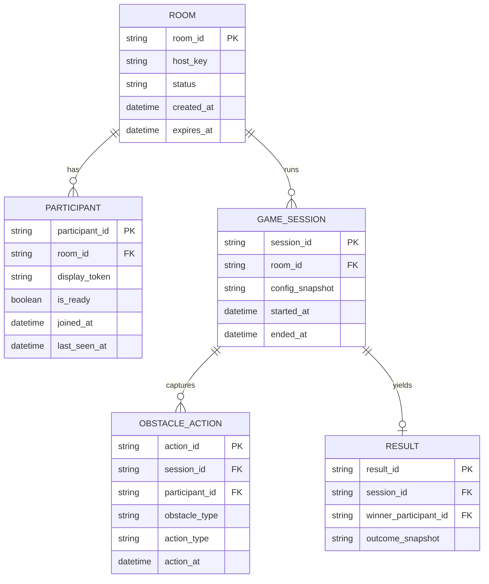

작성 기준: 젬스 문서가 제공되지 않아 일반 모범사례 기반으로 작성했습니다.

# Database Design — 마블 파티

MVP 캡슐(10줄)
1. 목표: 행사 현장에서 모두가 동시에 참여하는 공정한 제비뽑기 경험을 만든다
2. 페르소나: 오프라인 행사(세미나/파티) 참가자들
3. 핵심 기능(=FEAT-1): 방 생성·QR 입장(빠른 참여 + 대기실 확인)
4. 성공 지표(노스스타): 공정하다고 느낀 비율
5. 입력 지표(1~2개): 불만 제기 건수, 규칙 이해도
6. 비기능 요구(최소 1개): 모바일 웹에서 5초 내 입장 완료(현장 네트워크 기준)
7. Out-of-scope(이번엔 안 함): 룰렛/레이싱 실제 플레이, 장애물 조작, 당첨자 연출
8. Top 리스크 1개: MVP만으로 재미/몰입 검증이 부족함
9. 완화/실험 1개: 짧은 영상/종이 프로토타입으로 공정성·재미 설문
10. 다음 단계(바로 할 행동 1개): 행사 참가자 5명에게 입장 흐름 사용성 테스트

## 설계 원칙
- 최소 수집: 실명/연락처 저장 금지
- 임시 저장: 행사 종료 후 즉시 삭제
- 공정성 검증을 위한 최소 로그만 익명 집계

## 엔티티 메모
- ROOM: 방 상태와 만료 시간(TTL)만 유지
- PARTICIPANT: 개인 식별 정보 없이 임시 토큰만 사용
- GAME_SESSION/RESULT: 추후 확장용, MVP에서는 생성하지 않음

## Top 리스크 보드(5)
| 가정 | 리스크 | 완화 | 트리거 | 대응 |
|---|---|---|---|---|
| QR로 빠르게 접속할 수 있다 | 현장 네트워크 불안정으로 입장 실패 | 재접속 가이드/대기 연장 | 접속 실패율 20% 이상 | 진행자 핫스팟 안내 |
| 장애물 조작이 공정하게 느껴진다 | 공이 아예 안 떨어지는 체감 | 장애물 효과/쿨다운 제한 | 불공정 불만 1건 이상 | 즉시 재설정/재시작 |
| MVP만으로 가치 검증 가능 | 재미/몰입 검증 부족 | 영상/종이 프로토타입 테스트 | “재미 모르겠다” 응답 다수 | FEAT-2/3 우선 개발 전환 |
| 진행자가 쉽게 운영 가능 | 설정이 복잡해 진행 지연 | 기본 프리셋 제공 | 설정 시간 1분 초과 | 단계 축소/자동화 |
| 익명 참여로 충분 | 참여자 식별 불가 | 선택적 닉네임/좌석번호 | 식별 요청 발생 | 최소 입력 추가 |

## 근거(Decision Log)
- {D-01, 항목: 프로젝트 이름, 선택: "마블 파티", 근거: 사용자 직접 입력, 영향: 문서 전체 명칭, 보류안: 없음}
- {D-02, 항목: 한 문장 요약, 선택: "레이싱형 제비뽑기", 근거: 사용자 설명, 영향: 핵심 경험 정의, 보류안: 없음}
- {D-03, 항목: 동기, 선택: "행사/팀 활동 참여 도구 필요", 근거: 사용자 선택, 영향: 현장성 중심 설계, 보류안: 없음}
- {D-04, 항목: 문제, 선택: "참여자 수동성", 근거: 사용자 답변, 영향: 상호작용 중심 설계, 보류안: 없음}
- {D-05, 항목: 페르소나, 선택: "오프라인 행사 참가자", 근거: 사용자 선택, 영향: 짧은 집중 설계, 보류안: 없음}
- {D-06, 항목: 사용 상황, 선택: "경품 발표 직전/직후", 근거: 사용자 선택, 영향: 짧은 세션 UX, 보류안: 없음}
- {D-07, 항목: 핵심 기능 3개, 선택: "방 생성·QR 입장/룰렛 시작/장애물 버튼", 근거: 사용자 선택, 영향: FEAT-1~3 정의, 보류안: 없음}
- {D-08, 항목: MVP 단일 핵심, 선택: "방 생성·QR 입장", 근거: 사용자 선택, 영향: MVP 범위 고정, 보류안: FEAT-2/3}
- {D-09, 항목: 피하고 싶은 경험, 선택: "불공정 체감", 근거: 사용자 답변, 영향: 공정성 가드레일, 보류안: 없음}
- {D-10, 항목: UX 톤, 선택: "게임쇼 느낌(과하지 않게)", 근거: 사용자 답변, 영향: 디자인 톤, 보류안: 없음}
- {D-11, 항목: 사용 환경, 선택: "웹(모바일 웹/프로젝터)", 근거: 사용자 답변, 영향: 웹 중심 설계, 보류안: 앱 전용}
- {D-12, 항목: 외부 연동, 선택: "없음(QR은 접속용)", 근거: 사용자 답변, 영향: 단순 흐름, 보류안: 소셜로그인/결제}
- {D-13, 항목: 데이터 저장, 선택: "행사 종료 후 삭제", 근거: 사용자 답변, 영향: 임시 저장, 보류안: 영구 저장}
- {D-14, 항목: 궁극 변화, 선택: "몰입/기억 강화", 근거: 사용자 선택, 영향: 경험 설계 기준, 보류안: 없음}
- {D-15, 항목: 말투, 선택: "쇼 진행자 톤", 근거: 사용자 답변, 영향: 카피 톤, 보류안: 없음}
- {D-16, 항목: 지표, 선택: "공정성 체감/불만/규칙 이해", 근거: 사용자 선택, 영향: 측정 설계, 보류안: 몰입/만족도}
- {D-17, 항목: 수익화, 선택: "브랜드 스폰서/협찬형", 근거: 사용자 선택, 영향: 테마 연계 가능, 보류안: 유료 플랜}
- {D-18, 항목: 검증 질문, 선택: "룰렛+참여자 버튼 방식의 재미 여부", 근거: 사용자 답변, 영향: 사용자 인터뷰 설계, 보류안: 없음}
